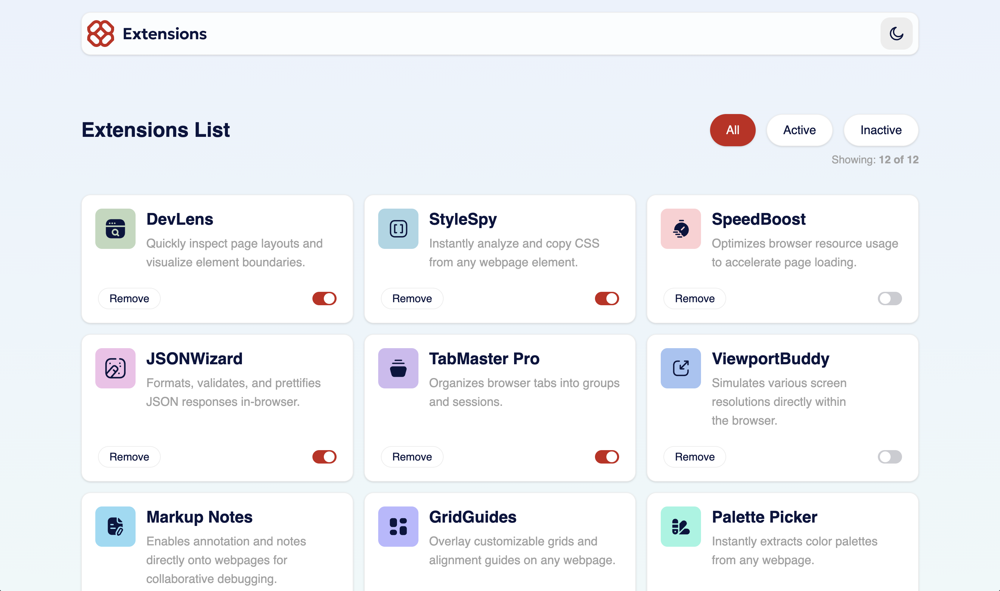

# Frontend Mentor - Browser Extensions Manager Solution

This is a solution to the [Browser extensions manager UI challenge on Frontend Mentor](https://www.frontendmentor.io/challenges/browser-extension-manager-ui-yNZnOfsMAp). Frontend Mentor challenges help you improve your coding skills by building realistic projects.

### The challenge

Users should be able to:

- Toggle extensions between active and inactive states
- Filter active and inactive extensions
- Remove extensions from the list
- Select their color theme
- View the optimal layout for the interface depending on their device's screen size
- See hover and focus states for all interactive elements on the page

### Screenshot

### Links

- Solution URL: [FEM-Browser Extensions Manager Solution](https://github.com/mattdavis06/fem-browser-extensions-manage)
- Live Site URL: [browser-extensions-manager](https://fem-browser-extensions-manage.netlify.app)

### Built with

- Semantic HTML5 markup
- CSS Flexbox
- CSS Grid
- [TailwindCSS](https://tailwindcss.com/) - Utility-first CSS framework
- [Shadcn](https://arc.net/l/quote/aauthmgi) - A UI component library primarily used for React development that allows you to build modern, customizable, and accessible web interfaces.
- [React](https://reactjs.org/) - JS library
- [TypeScript](https://www.typescriptlang.org/) - Superset of JavaScript
- [ViteJS](https://vitejs.dev/) - Next Generation Frontend Tooling
- [Zustand](https://zustand-demo.pmnd.rs/) - A small, fast and scalable bearbones state-management solution using simplified flux principles.
- Mobile-first workflow

## Author

- Website - [mdavis.dev](https://www.mdavis.dev)
- Frontend Mentor - [@mattdavis06](https://www.frontendmentor.io/profile/mattdavis06)
